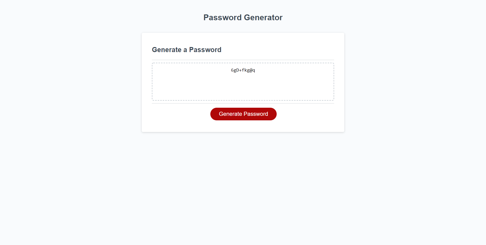

# password-generator-project
An application for generating secure and unique passwords. 

## Table of contents
- [Deployed Website](#deployedwebsite)
- [Description](#description)
- [Screenshots](#screenshots)
- [Tech/Framework](#tech/framework)
- [Contribution](#contribution)
- [License](#license)

## Deployed Website

 https://jessgreene9.github.io/password-generator-project/

## Description

This application enables employees to generate secure, unique, and random passwords based on the criteria that they've selected. This app is powered by Javascript and is easy to use. Simply follow the prompts to generate a secure and unique password!

The password must be between 8 and 128 characters and you must select at least one type of character for the password to generate. 

Once the choices are made, a password generates using random characters from each chosen character type and displays on the screen. 

## Screenshots

## Tech/Framework

VS Code

## Contribution

This project was made with help from:

* UNCC BootCamp class
* My tutor, Josh Furlin

## License

